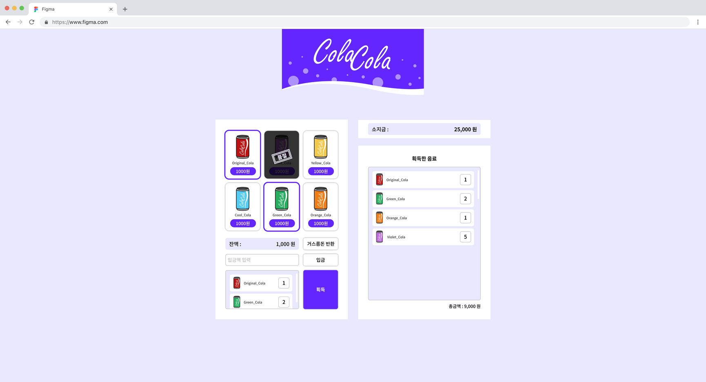
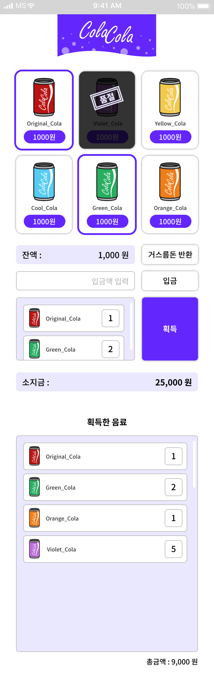

# 벤딩 머신

### git 커밋 켄벤션

| 태그 이름 | 설명                         |
| --------- | ---------------------------- |
| Feat      | 새로운 기능을 추가할 경우    |
| Fix       | 버그를 고친 경우             |
| Design    | CSS 등 사용자 UI 디자인 변경 |
| Docs      | 문서를 수정한 경우           |

### 디자인 시안

  
  

### 요구사항 명세

1. 판매할 음료에 대한 데이터는 따로 분리되어 있어야 합니다. (혹은 API로 받아야 합니다.)
2. 돈의 입금과 음료의 선택 시점은 자유롭지만 돈이 모자라면 음료가 나와서는 안됩니다.
3. 거스름돈이 나와야 합니다.
4. 버튼을 누르면 상품이 1개씩 추가됩니다. (일반적인 자판기와 동일)
